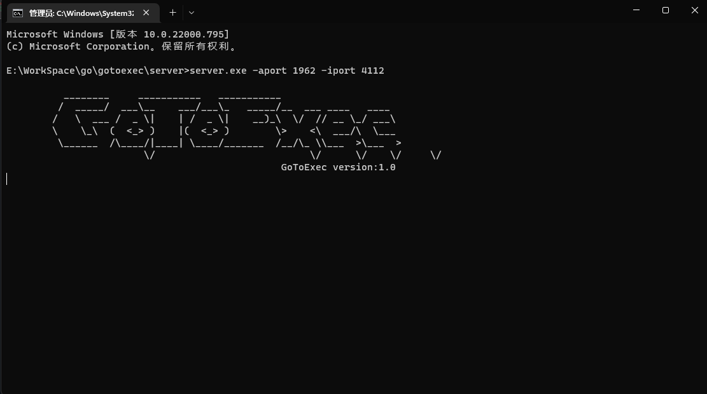
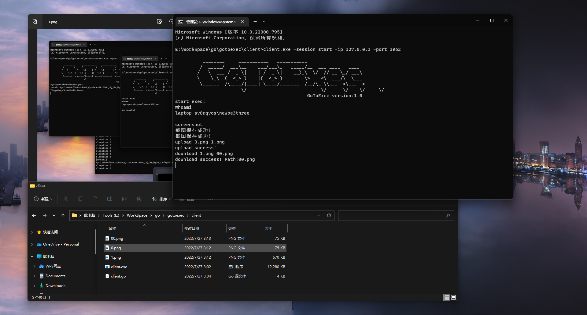

# gotoexec

### 简介

通过Go语言实现的一款基于gRPC的远控木马。

### 使用方法

程序分为三个部分：植入程序、服务端、客户端。分别对应目录：implant、server、client。每个部分都需要进行独立的编译和运行。

#### implant

implant：运行再目标机器上，远程服务端的IP硬编码卸载implant.go中，也就是说对于不同的服务端需要进行单独编译生成可以执行文件。

#### server

server：运行在服务端，通过参数iport和aport指定植入程序和客户端对应的端口号。

```
server.exe -iport 1961 -aport 1962

-aport int
    	Admin server port (default 1962)
-iport int
    	Implant server port (default 1961)

```

#### client

client：可以执行

##### 参数

```
client.exe -session start -IP 127.0.0.1 -port 1962 -sleep 5

-ip string
        Server IP (default "127.0.0.1")
-port int
        AdminServer Port (default 1962)
 -session string
        start session
 -sleep int
        sleep time
```

##### 功能

截图以png格式保存client.exe运行目录下

上传、下载文件大小限制在10MB内

```
截图：	screenshot
上传：	upload 本地文件 目标文件  
下载：	download 目标文件 本地文件
```


#### 编译命令

```
go build -ldflags "-s -w" -trimpath
```

对于implant植入程序，可以考虑使用upx压缩缩小体积。


### 运行截图


